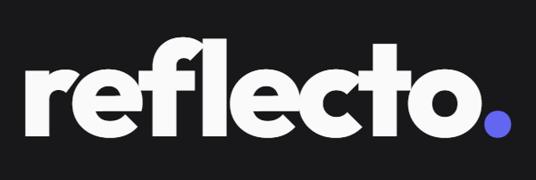
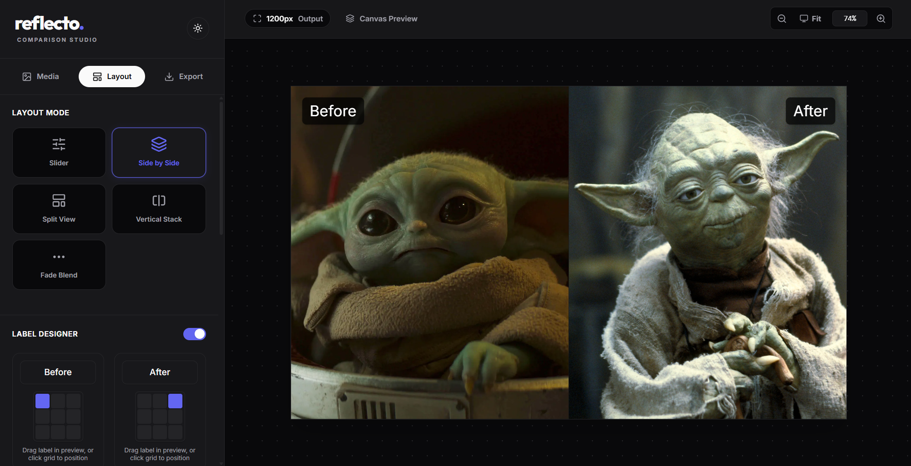

<div align="center">
  
  <p><strong>Create beautiful, high-resolution before & after comparisons.</strong></p>
  
  <p>
    <a href="https://github.com/andrear9/reflecto/releases"></a>
    <a href="https://github.com/andrear9/reflecto/blob/main/LICENSE"></a>
    <a href="https://react.dev/"></a>
    <a href="https://vitejs.dev/"></a>
    <a href="https://tailwindcss.com/"></a>
    <a href="https://developer.mozilla.org/en-US/docs/Web/API/WebCodecs_API"></a>
  </p>
</div>

---

## ✦ Overview

**Reflecto** is a modern, privacy-first, client-side web application designed to generate stunning 'before and after' image comparisons. Whether you're a designer showcasing a rebrand, a photographer displaying editing transformations, or a developer presenting UI upgrades, Reflecto provides a robust toolkit to frame, label, and export your comparisons flawlessly.

Built with performance in mind, Reflecto uses a highly optimized Canvas rendering pipeline and modern WebCodecs APIs to generate smooth, high-fidelity MP4 videos, animated GIFs, and images directly in the browser—with zero server processing.

<br>

<div align="center">
  
  <p><em>Turn raw assets into engaging, social-ready comparisons in seconds.</em></p>
</div>

<br>

## ✨ Features

- **5 Distinct Comparison Modes**: Slider, Side-by-Side, Diagonal Split, Vertical Stack, and Alpha Fade transitions.
- **Hardware-Accelerated Video Exports**: Leverages native `VideoEncoder` (WebCodecs API) for lightning-fast 60FPS MP4 generation.
- **Pixel-Perfect Canvas Engine**: Dial in custom padding, viewport inset spacing, boundary border radii, and dynamic background colors.
- **Drag-and-Drop Labeling**: Free-form floating text labels with customizable typography, opacities, and interactive snapping boundaries.
- **Image Treatment Layer**: Built-in visual adjustment filters (Brightness, Contrast, Saturation) mapped individually per layer.
- **Zero-Server Processing**: Completely client-side architecture. No user images are ever uploaded or transmitted remotely.
- **Fluid Workspace**: Adaptive interface with native dark/light theming, clipboard copying, and seamless touch/mouse pointer scaling.

<br>

<div align="center">
  
</div>

<br>

---

## 🔄 The Export Pipeline

Reflecto's export engine is purpose-built to bypass traditional server-side rendering bottlenecks:

### Video Encoding (MP4)
Instead of capturing the DOM continuously (which causes framerate drops), Reflecto utilizes an optimized `requestAnimationFrame` loop. It pre-caches the 'before' and 'after' assets as raw bitmaps via `html-to-image`, and composits the transition math (bezier curves, sine easing, UI handles) dynamically onto a hidden 2D buffer canvas. The buffer is shipped frame-by-frame directly to the browser's native `VideoEncoder` leveraging the `mp4-muxer` library. 

### Animated GIFs
For legacy formats, Reflecto uses `gifenc`. By scaling down internal viewports and aggressively optimizing color palettes using NeuQuant chunking, it guarantees highly shareable, sub-10MB files without compromising the perceptual quality of the animation structure.

### High-Resolution Stills
Single-frame snaps are processed with dynamic density scaling to ensure retina-ready (2x/3x) exports, and can be instantly copied to the user's OS clipboard using the asynchronous Clipboard API.

---

## 🚀 Getting Started

### Local Development Workflow

Reflecto is built to be fast, typed, and dependency-light.

**1. Clone the repository**
```bash
git clone https://github.com/yourusername/reflecto.git
cd reflecto
```

**2. Install dependencies**
```bash
npm install
```

**3. Start the development server**
```bash
npm run dev
```

The application will be accessible at `http://localhost:3000`.

### Environment Configuration

By default, Reflecto requires zero environment variables to run its core capabilities. If you plan to extend the application, duplicate the example file:

```bash
cp .env.example .env.local
```

### Build & Production
To generate a highly optimized static build for production platforms:

```bash
npm run build
```
The output will be compiled to the `/dist` directory, fully minified and tree-shaken by Vite. 

To preview the production build locally:
```bash
npm run preview
```

---

## 🏗 Architecture & Tech Stack

Reflecto balances structural integrity with cutting-edge front-end patterns:

- **Framework**: `React 19` for component lifecycles and state predictability.
- **Build Tool**: `Vite` for sub-second HMR and optimized rollout logic.
- **Styling**: `Tailwind CSS v4` handles all layout geometries, color primitives, and responsive micro-adjustments decoupled from specific components.
- **Icons**: `lucide-react` for clean, consistent, geometric iconography.
- **DOM Rendering**: `html-to-image` traverses React's virtual DOM structure to clone and render SVG/Canvas nodes.
- **Video Multiplexing**: `mp4-muxer` combined with WebCodecs API provides raw throughput.

### Performance Optimizations

- **Debounced Resizing**: The workspace actively intercepts `ResizeObserver` events to prevent layout thrashing on window resizes.
- **No-React Rendering Loops**: The `exportVideoTask` operates purely on standard browser Canvas APIs, aggressively keeping standard React re-renders out of the generation loop.
- **Pointer Event Delegation**: The label dragging system uses unified pointer events (`setPointerCapture`) natively, ensuring 120Hz smooth tracking on modern iPads and trackpads without heavy library overhead.

---

## 📱 Responsive & Cross-Platform

Reflecto treats screen real estate as a fluid commodity:
- **Desktop/Laptop**: Multi-column architecture prioritizing the canvas viewport with sticky side-panel configurations. 
- **Tablet (Landscape/Portrait)**: Responsive flex-wrapping ensures toolbar utility remains accessible without compromising the touch targets of the canvas.
- **Mobile Devices**: Focuses heavily on native sliding bottom sheets, horizontal scroll regions for media choices, and enforces native touch-action bounds.

---

## 🤝 Contributing

We welcome contributions of all shapes. If you want to improve Reflecto:

1. **Fork the repository** and create a feature branch (`git checkout -b feature/amazing-idea`).
2. **Commit your changes** using conventional commit messages (`feat: add webm support`).
3. **Push to the branch** (`git push origin feature/amazing-idea`).
4. **Open a Pull Request** describing the context, intent, and testing applied.

Please ensure the TypeScript linter passes (`npm run lint`) prior to submitting PRs.

---

## 🗺 Roadmap

- [ ] **WebM/ProRes Support**: Export alpha-channel transparent videos.
- [ ] **Custom Watermarking**: Allow users to drop SVG vectors directly into the export queue.
- [ ] **Social Presets**: 1-click aspect ratio crops for Instagram Reels, X headers, and Dribbble shots.
- [ ] **Zoom/Pan Keyframing**: "Ken Burns" style movement leading into the comparison reveals.

---

## ❓ FAQ & Troubleshooting

**Exported Video is corrupted on older MacOS machines**  
WebCodecs implementation varies by browser. Ensure you are using the latest Chromium-based browser (Chrome, Edge, Brave) for flawless h264 (`avc1`) encoding compliance. 

**Image exports are returning blank or tainted**  
If you are loading images from external domains, ensure modern CORS policies are met, or use the direct file uploader which relies on local `URL.createObjectURL()`.

---

## 📜 License

Distributed under the MIT License. See `LICENSE` for more information.

---

<div align="center">
  <p>Crafted & maintained with passion. <br> <a href="https://github.com/andrear9/reflecto">Leave a star</a> if you find this tool helpful.</p>
</div>
